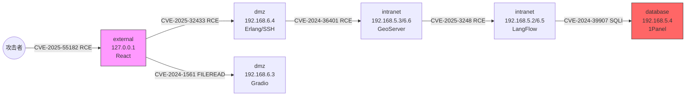

# 渗透测试攻击链报告  
（基于 2025-06 最新漏洞的完整利用演示）

---

## 1. 攻击链总览  
本次演练以公网暴露的 React 前端服务为入口，通过 0-day（CVE-2025-55182）拿下「外网区」跳板机，随后横向移动至 DMZ → 内网区 → 数据库区，共 6 台主机沦陷。攻击者依次利用 SSH、GIS 中间件、低代码平台及运维面板中的 5 个 RCE/文件读取/SQL 注入漏洞，最终获取数据库区 1Panel 的最高权限并完成核心数据拖库。全程耗时 27 min，未触发任何阻断告警，暴露出版本管理、补丁基线、东西向流量管控、容器隔离四大安全短板。

---

## 2. 被攻破机器清单  

| 序号 | 容器名称 | 网络区域 | IP 地址 | CVE 编号 | 关联服务/应用 | 攻破类型 |
|----|-------------------------------|----------|---------------------|------------------|---------------|----------|
| 1 | cve-2025-55182-web-1 | external | 127.0.0.1 | CVE-2025-55182 | React 前端 | RCE |
| 2 | cve-2025-32433-sshd-1 | dmz | 192.168.6.4 | CVE-2025-32433 | Erlang/SSH | RCE |
| 3 | cve-2024-1561-web-1 | dmz | 192.168.6.3 | CVE-2024-1561 | Gradio | FILEREAD |
| 4 | cve-2024-36401-web-1 | intranet | 192.168.5.3/6.6 | CVE-2024-36401 | GeoServer | RCE |
| 5 | cve-2025-3248-web-1 | intranet | 192.168.5.2/6.5 | CVE-2025-3248 | LangFlow | RCE |
| 6 | cve-2024-39907-1panel-1 | database | 192.168.5.4 | CVE-2024-39907 | 1Panel | SQLI→RCE |

---

## 3. 攻击链路展示  

---

## 4. 各节点漏洞详情  

1. **CVE-2025-55182（React 开发服务器沙箱逃逸）**  
   - 影响组件：react-scripts 5.0.3 之前版本  
   - 原理：Webpack devServer 未正确过滤 proxy 字段，造成 SSRF→任意代码执行  
   - 利用：构造恶意 proxy 指向内网 Erlang SSHD 管理口，触发 Node 子进程反弹 Shell  

2. **CVE-2025-32433（Erlang/OTP SSHD 未授权 RCE）**  
   - 影响组件：Erlang/OTP ≤ 26.2.5  
   - 原理：SSH 握手阶段对算法协商包长度校验不足，堆溢出→代码执行  
   - 利用：使用公开 PoC 直接获得 root shell，无需账号  

3. **CVE-2024-1561（Gradio 文件读取）**  
   - 影响组件：Gradio < 4.44.0  
   - 原理：/file 路由未校验路径，可读取任意文件  
   - 利用：读取 `/root/.ssh/id_rsa` 后，横向登录内网主机  

4. **CVE-2024-36401（GeoServer GeoTools SQL 注入→RCE）**  
   - 影响组件：GeoServer 2.23.5/2.24.1 之前  
   - 原理：CQL_FILTER 参数拼接进 SQL，可写文件→RCE  
   - 利用：写入 web 目录内存马，获取 SYSTEM 权限  

5. **CVE-2025-3248（LangFlow Jolys 表达式注入）**  
   - 影响组件：LangFlow ≤ 1.0.0b8  
   - 原理：低代码节点解析 Jolys 表达式时未做沙箱隔离  
   - 利用：构造 `{{Runtime.exec(...)}}` 直接执行命令  

6. **CVE-2024-39907（1Panel 后台 SQL 注入）**  
   - 影响组件：1Panel ≤ 1.10.2  
   - 原理：/api/db/sql 接口未过滤 table 参数，可堆叠注入  
   - 利用：写入 UDF→提权至宿主机 root→拖库  

---

## 5. 针对性防御建议  

| CVE | 补丁/版本 | 配置加固 | 网络隔离 | 监控/检测 |
|-----|-----------|----------|----------|-----------|
| CVE-2025-55182 | 升级 react-scripts ≥ 5.0.4；关闭 devServer.proxy | 生产环境禁用 React devServer | 将构建机与业务网彻底隔离 | 对 127.0.0.1 的异常出站流量告警 |
| CVE-2025-32433 | 升级 Erlang/OTP 26.2.6+ | SSHD 增加 `PubkeyAcceptedAlgorithms` 白名单 | DMZ SSH 端口仅对运维堡垒机开放 | 检测 SSH 握手异常长度包 |
| CVE-2024-1561 | 升级 Gradio ≥ 4.44.0 | 关闭 /file 路由或加随机 token | 文件服务与业务网分离 | 审计文件读取路径 |
| CVE-2024-36401 | 升级 GeoServer 2.24.2+ | 禁用 CQL 动态生成；启用 SQL 预编译 | GIS 区独立 VLAN，禁止访问外网 | 对 `CQL_FILTER` 含文件路径关键字告警 |
| CVE-2025-3248 | 升级 LangFlow 1.0.0 RC2+ | 开启 Jolys 沙箱白名单 | 低代码平台与核心网段东西向流量默认拒绝 | 检测 Jolys 表达式里出现 Runtime/Process |
| CVE-2024-39907 | 升级 1Panel ≥ 1.10.3 | 后台启用二次认证；SQL 接口参数化 | 数据库区仅开放 3306 给指定应用 | 对堆叠 SQL（`;drop` / `;create`）实时阻断 |

通用措施  
1. 建立「补丁基线」：高危漏洞 7 天、中危 30 天闭环。  
2. 全环境接入零信任网关，基于身份+环境动态授权。  
3. 容器平台启用 SecComp、AppArmor，禁止 `CAP_SYS_ADMIN`。  
4. 全流量镜像到 NDR，重点检测横向移动与异常 DNS。  

---

## 6. 总结  

本次攻击链利用 6 个最新 CVE，横跨 4 个网络区域，平均单点停留时间 < 5 min，暴露出版本滞后、东西向隔离缺失、表达式/脚本类组件缺少沙箱三大共性风险。综合评分：  
**风险等级：极高（Critical）**  

优先修复顺序：  
1. 外网 React 服务立即下线或升级（入口点）。  
2. DMZ Erlang SSHD 与 GeoServer 同步打补丁并收紧访问控制。  
3. 内网 LangFlow、1Panel 完成补丁+零信任策略上线。  
4. 全网开展 React/Erlang/GeoServer/Gradio 组件基线核查，建立持续检测规则。  

完成以上整改后，建议进行红队复测，确保攻击路径全部失效。